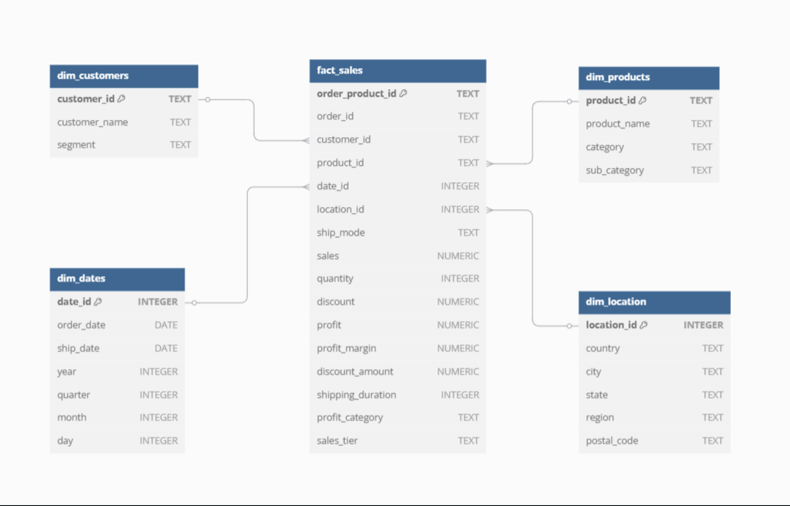
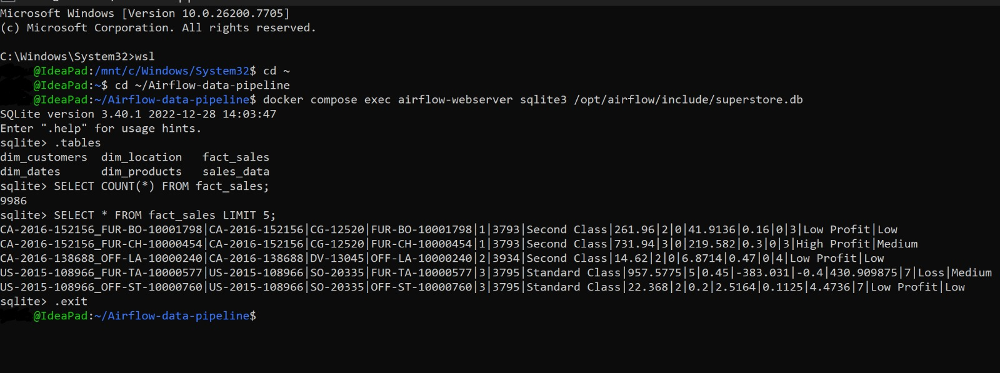

# Airflow Sales ETL Pipeline

A production-style **ETL + dimensional modeling** project built with **Apache Airflow**, **Python**, and **SQLite**, using the Superstore dataset as a source.

This repository demonstrates how to:
- ingest raw sales data,
- apply transformation logic and derived business metrics,
- load a warehouse-ready star schema,
- and validate output quality with automated tests.

For portfolio/recruiter review, see **[README_PORTFOLIO.md](README_PORTFOLIO.md)**.

---

## 1) Project Overview

### Objective
Build an orchestrated data pipeline that transforms `Superstore.csv` into a query-ready analytical model.

### Core Workflow
1. Load source CSV into a staging table (`sales_data`).
2. Build dimension tables:
   - `dim_customers`
   - `dim_products`
   - `dim_dates`
   - `dim_location`
3. Build the fact table (`fact_sales`) by joining staging records to dimensions.
4. Validate key quality rules with `pytest`.

### Main DAG
- **DAG ID:** `superstore_data_pipeline_sqlite`
- **Definition file:** `dags/superstore_pipeline_sqlite.py`

---

## 2) Data Source and Target

### Input
- `include/Superstore.csv`
- File contains **9,994** source rows and standard sales attributes (order, customer, product, location, and financial fields).

### Output Warehouse
- `include/superstore.db` (SQLite)
- Tables created/populated by DAG tasks:
  - `sales_data` (staging)
  - `dim_customers`
  - `dim_products`
  - `dim_dates`
  - `dim_location`
  - `fact_sales`

> Note: In this repository snapshot, `superstore.db` is present for convenience. In normal operation, it is produced/refreshed by pipeline execution.

---

## 3) Transformation Logic

The staging task (`process_and_load_data`) performs:
- column cleanup (`Row ID` dropped if present),
- null handling (`Postal Code` fallback),
- date parsing (`Order Date`, `Ship Date`),
- derived metrics:
  - `Profit Margin`
  - `Discount Amount`
  - `Shipping Duration`
- business buckets:
  - `Profit Category` (`Loss`, `Low Profit`, `High Profit`)
  - `Sales Tier` (`Low`, `Medium`, `High`)
- date decomposition:
  - `Year`, `Quarter`, `Month`, `Day`
- duplicate prevention via `order_product_id = order_id + '_' + product_id`.

Dimension and fact builders are implemented in `dags/superstore_transformation.py` and execute after staging.

---

## 4) Data Model (Star Schema)

The warehouse follows a classic star schema:
- **Fact table:** `fact_sales`
- **Dimension tables:** `dim_customers`, `dim_products`, `dim_dates`, `dim_location`

Schema diagram:



This design separates measurable events (sales/profit/quantity) from descriptive entities (customer/product/date/location), improving analytical usability.

---

## 5) Pipeline Orchestration in Airflow

Task graph:
1. `process_and_load_data`
2. Parallel dimension build:
   - `create_dim_customers`
   - `create_dim_products`
   - `create_dim_dates`
   - `create_dim_location`
3. `create_fact_sales`

DAG dependency pattern:

`staging >> [all dimensions in parallel] >> fact`

DAG visualization (from this repo):


---

## 6) Current Warehouse Snapshot

From the included SQLite file (`include/superstore.db`):
- `sales_data`: 19,972 rows
- `dim_customers`: 793 rows
- `dim_products`: 1,862 rows
- `dim_dates`: 1,037 rows
- `dim_location`: 1,264 rows
- `fact_sales`: 9,986 rows

SQLite table preview image:



---

## 7) Repository Structure

```text
.
├── dags/
│   ├── superstore_pipeline_sqlite.py      # Main ETL + orchestration DAG
│   ├── superstore_transformation.py       # Dimension/fact build functions
│   └── exampledag.py                      # Example Astronomer DAG
├── include/
│   ├── Superstore.csv                     # Raw source data
│   └── superstore.db                      # SQLite warehouse
├── model/                                 # Quick query scripts for each table
│   ├── sales_data.py
│   ├── dim_customers.py
│   ├── dim_products.py
│   ├── dim_dates.py
│   ├── dim_location.py
│   └── fact_sales.py
├── tests/
│   ├── test_data_quality.py               # Warehouse/data assertions
│   └── dags/test_dag_example.py           # DAG import/tag/retry checks
├── Dockerfile
├── requirements.txt
├── packages.txt
└── README.md
```

---

## 8) Prerequisites

Choose one execution approach:

### Option A: Astronomer Runtime (recommended)
- Docker installed
- Astro CLI installed

### Option B: Local Python + Airflow
- Python 3.9+
- Apache Airflow environment configured manually
- Dependencies from your Airflow setup

> The provided `Dockerfile` is based on `quay.io/astronomer/astro-runtime:12.7.0`.

---

## 9) How to Run

### Using Astro CLI

```bash
astro dev start
```

Then open Airflow at:

```text
http://localhost:8080
```

Trigger DAG:

```text
superstore_data_pipeline_sqlite
```

### Validate Warehouse Manually (SQLite)

```bash
sqlite3 include/superstore.db
.tables
SELECT COUNT(*) FROM fact_sales;
```

---

## 10) Testing and Data Quality

### Run tests

```bash
pytest -q
```

### What is validated
- `fact_sales` exists and is populated.
- No nulls in critical identifiers.
- No negative sales.
- No non-positive quantities.
- No duplicate `order_product_id` in fact table.
- Every fact row has a valid customer dimension match.
