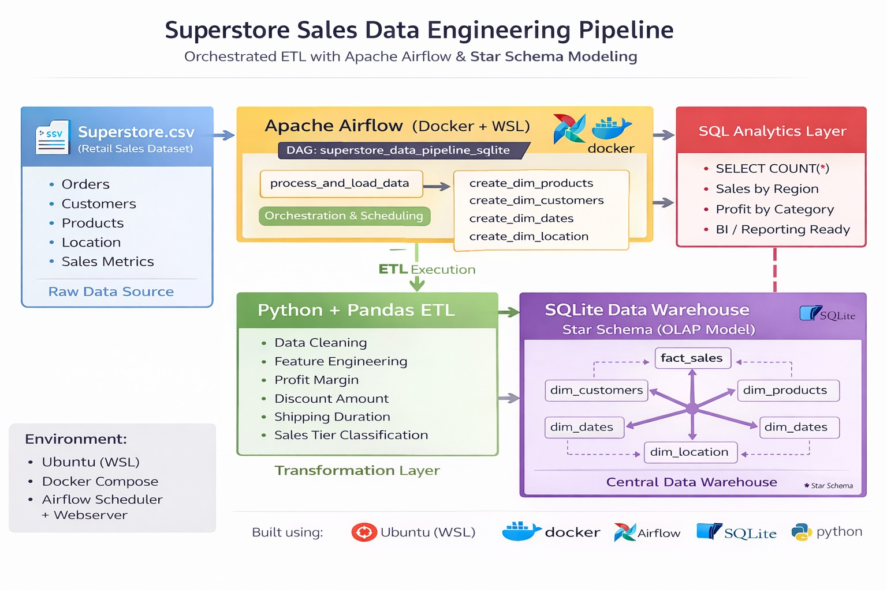
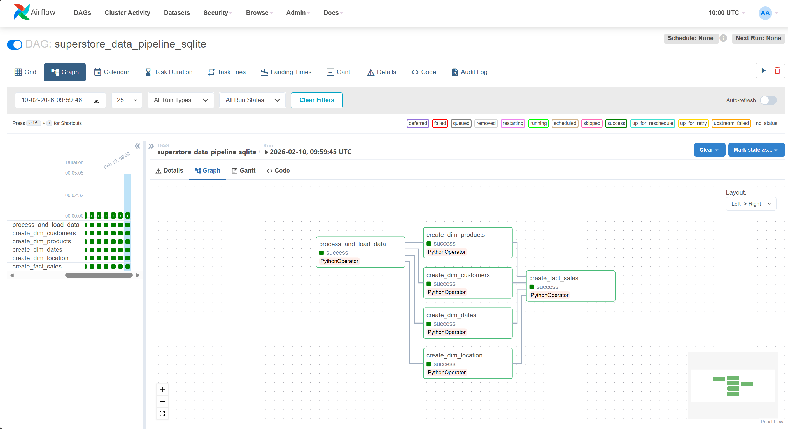
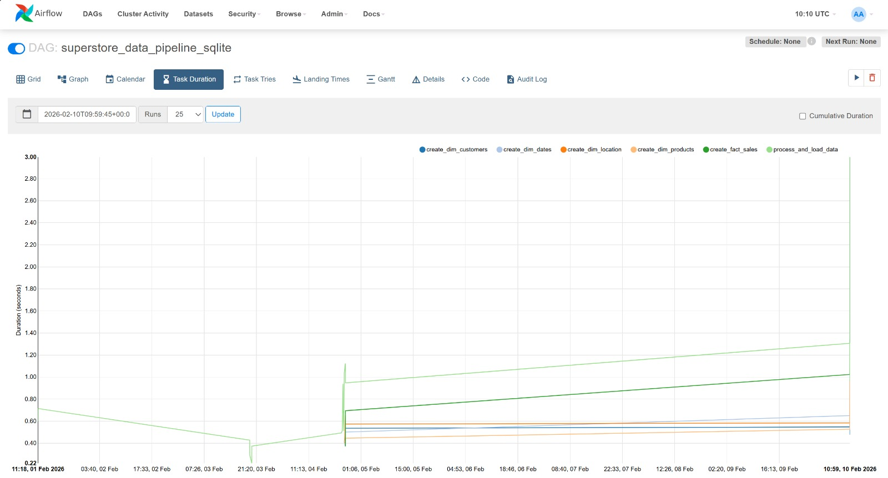

#  Airflow-Sales-ETL-Pipeline


An end-to-end Data Engineering project that implements a production-style ETL pipeline using Apache Airflow and Docker, transforming raw transactional CSV data into an analytics-ready Star Schema data warehouse in SQLite.

This project demonstrates how batch data pipelines are designed, orchestrated, modeled, validated, and made reproducible for real-world analytics use cases.

---

##  Project Overview

This project demonstrates how raw business data (CSV) can be:

-   Extracted
-   Cleaned and transformed
-   Modeled into Fact & Dimension tables
-   Orchestrated using Apache Airflow
-   Stored in a SQLite data warehouse

---

##  Architecture


---

## Airflow View 
1. Airflow DAG Graph View


2. Airflow Performance Metrics


---

##  Data Modeling (Star Schema)


---

##  ETL Workflow

### Extract

-   Load Superstore.csv
-   Parse date fields
-   Validate schema

### Transform

-   Profit margin calculation
-   Shipping duration calculation
-   Discount amount calculation
-   Sales tier classification
-   Normalize into dimension tables

### Load

-   Insert into staging table
-   Create dimension tables
-   Build fact table with relationships

---

##  Database Verification

SQLite Tables View and Fact Table Query Result


---

##  Project Structure

```bash
Airflow-data-pipeline/
│
├── dags/
│   ├── superstore_pipeline_sqlite.py
│   └── superstore_transformation.py
│
├── include/
│   ├── Superstore.csv
│   └── superstore.db
│
├── docker-compose.yml
├── requirements.txt
├── README.md
└── images/
    ├── Architecture.png
    ├── airflow_graph.png
    ├── airflow_task_duration_chart.png
    ├── star_schema.png
    └── sqlite_tables.png
```

##  Tech Stack

-   Apache Airflow
-   Docker
-   WSL
-   SQLite
-   Pandas
-   SQLAlchemy
-   Python

---

##  Future Improvements

-   Replace SQLite with PostgreSQL
-   Implement Incremental Loads
-   Deploy to Cloud

---

## License


This repository is licensed under the terms in `MIT LICENSE`.


